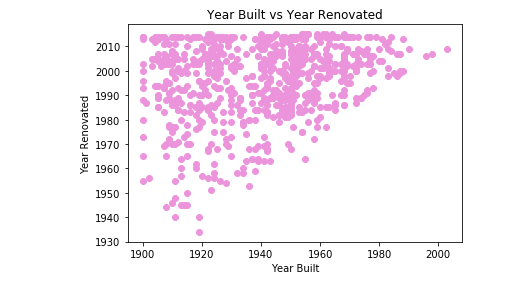

# Multiple Linear Regression Analysis Kings County House Sales

#### For my first foray into data science I will be running a multiple liear regression analysis on the Kings County House Sales. The dataset includes information on houses sold from May 2014 - May 2015. 

# Essential info on columns (before any manipulation):

1) **id:** a notation for a house

2) **date:** Date house was sold

3) **price:** Price is prediction target

4) **bedrooms:** Number of Bedrooms/House

5) **bathrooms:** Number of bathrooms/bedrooms

6) **sqft_living:** square footage of the home

7) **sqft_lot:** square footage of the lot

8) **floors:** Total floors (levels) in house

9) **waterfront:** House which has a view to a waterfront

10) **view:** Has been viewed

11) **condition:** How good the condition is ( Overall ). 1 indicates worn out property and 5 excellent. 

12) **grade:** Overall grade given to the housing unit, based on King County grading system. 1 poor ,13 excellent.

13) **sqft_above:** Square footage of house apart from basement

14) **sqft_basement:** Square footage of the basement

15) **yr_built:** Year built

16) **yr_renovated:** Year when house was renovated

17) **zipcode:** zipcode

18) **lat:** Latitude coordinate

19) **long:** Longitude coordinate

20) **sqft_living15:** Living room area in 2015(implies-- some renovations) This might or might not have affected the lotsize area

21) **sqft_lot15:** lotSize area in 2015(implies-- some renovations)

# Cleaning the dataset

First, I checked the datasets info property.

I noticed immediately that sqft_basement is cast as an object and not a float property. Before casting as float, I'll first check the unique values to make sure that all values are, in fact, numbers. 

All values are numbers except one that is listed as a '?'. Only 454 values were found after doing a count of how many '?' were present in this set. All '?' were changed to the mean of the series and the column was cast as a float object.

Checked for null values again, this time I used the isna().sum() method 

Null values are present in yr_renovated, view, and waterfront. I filled view null values with the median and checked value counts on both year renovated and waterfront. Both series had over 90% of zero values. Will drop these series after some EDA. For now, filling null values with 0.

# EDA!
For my EDA I'd like the following questions answered..

## Question 1: Does the square footage of the total lot have an effect on the grade assigned to the property?

## Question 2: Is there a relationship between square footage of the house and grade assigned to the property

## Question 3: Is there a relationship between yr_built and yr_renovated? 

I will be running linear regression analysis on these variable comparisons. As I will be evaluating how sqft_lot and sqft_living effect grade I isolated these two variables into their own pandas dataframe and checked for normal distribution. Both distributions were skewed so I log normalized both sqft_lot and sqft_living. Grade, on the other hand was pretty normally distributed. 

I then used scatter plots to determine if there are any relationship between lotsize and livingsize with grade of the properties

Looking at the plots tells me that there is some relationship between the size of the house and grades. Although it's far from being perfectly linear you can see that as square feet increases the likelihood of a higher grade also increases. Furthermore,  it's clear that the highest grade you can achieve with a house <= 2,000 squarfeet is 10. Also, house > 7,000 you're pretty much guaranteed a grade above 10. As for lot square footage vs. grade there's no clear relationship between these two variables.

Next, I checked to see if year built had a relationship with year renovated, I used a scatterplot for comparisons. 

We cannot conclude that there is a direct relationship between the age of the house and the year that it was renovated but some observations can be made. 

1) There are higher instances of renovations in houses built before 1960. 

2) Houses tend to be renovated 10 - 20 years after they are built. 

3) Except for houses built in the year 1900, in which case the first instance of a renovation made was in 1955 a whooping 55 years after the house was built. Either houses in the year 1900 were built really sturdy or people weren't as concerned with renovations back then. 

# Multiple Regression Model

## The assumptions of a linear regression model states the following

1) The distribution of all variables to be multivariate normal

2) Little to no multicollinearity in the data

3) The data is homeocedastic

4) The relationship between the independent and dependent variable must be linear

We tested these assumptions against the data to ultimatey determing which feature best predicts the outcome of our target variable, price. Ultimately the features that met these assumptions (after log normalization) was condition, bedrooms, floors, and square feet of living space. Results were as follows:

# Findings

Key things to note: these are all log normalized features therefore a 1% increase in the independent variable yields the coefficent percent increase in the dependent variable, price.

Adding bedrooms have a negative impact on price.
Increasing square footage of living space by 10% yields an increase of 9.3% in price on average
Adding a floor, (aka increasing square-footage) yields an increase of 8% in price

